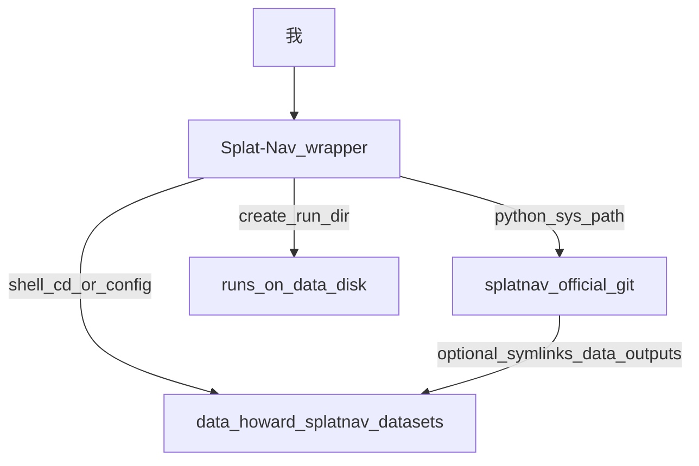

# Splat-Nav 工作区全景与上手手册（全量版）

**文档位置**：`/home/howard/Splat-Nav/docs/archive/SplatNav_项目全景与上手手册_全量版_2026-03-30.md`  
**姊妹篇**：基础知识与工具链见同目录 [`SplatNav_卷0_基础知识编_2026-03-30.md`](SplatNav_卷0_基础知识编_2026-03-30.md)。导出 PDF 时可配合 [`SplatNav_手册总目录_2026-03-30.md`](SplatNav_手册总目录_2026-03-30.md) 合并顺序。  
**维护说明**：日常小块更新仍以 `docs/00`～`docs/10` 为主，本文件用于一次性通读、导出 PDF 与交接。若命令或路径与仓库不一致，以当前仓库脚本为准。

---

## 目录

1. [开篇：给师弟的快速上手说明（先读这段）](#1-开篇给师弟的快速上手说明先读这段)
2. [本项目整体介绍：用大白话把项目说清楚](#2-本项目整体介绍用大白话把项目说清楚)
3. [输入、输出与一次运行的验收](#3-输入输出与一次运行的验收)
4. [目录与软链拓扑（新手向）](#4-目录与软链拓扑新手向)
5. [文件夹之间的关系与数据流](#5-文件夹之间的关系与数据流)
6. [根目录与配置文件逐说明](#6-根目录与配置文件逐说明)
7. [`scripts/` 脚本逐说明](#7-scripts-脚本逐说明)
8. [Python 脚本与主要逻辑](#8-python-脚本与主要逻辑)
9. [上游 `splatnav-official` 里有什么、怎么读](#9-上游-splatnav-official-里有什么怎么读)
10. [`docs/` 文档地图](#10-docs-文档地图)
11. [顺序化快速上手（从第一天到批跑）](#11-顺序化快速上手从第一天到批跑)
12. [跑完后优先打开哪些文件](#12-跑完后优先打开哪些文件)
13. [仍未完善之处与我建议的补齐顺序](#13-仍未完善之处与我建议的补齐顺序)
14. [一周、一月、三个月的阶段性目标](#14-一周一月三个月的阶段性目标)
15. [附录：术语与路径速查](#15-附录术语与路径速查)

---

## 1. 开篇：给师弟的快速上手说明（先读这段）

这一段专门写给 **刚接触本仓库的师弟**。不用一次全懂，按下面顺序做就行。看不懂的词可以跳过去，先 **把手放在键盘上跑通一次**，再回头查 [`SplatNav_卷0_基础知识编_2026-03-30.md`](SplatNav_卷0_基础知识编_2026-03-30.md)。

### 1.1 你用一句话记住：这个文件夹是干什么的

**`/home/howard/Splat-Nav` 是「辅助工程文件夹」**，里面主要是 **脚本、说明文档、Makefile**，帮你 **装环境、下数据、跑实验、记日志**。  
**论文里的核心算法代码不在这里面单独存一份**，而在 **`splatnav-official` 这一棵目录**里（通过快捷方式链到硬盘上的官方仓库）。你可以把现在看的这个文件夹理解成 **「实验室师兄给你搭好的操作台」**，真正「论文原版代码」在台子旁边的 **官方树** 里。

### 1.2 你第一天只要搞懂四件事

**第一件事：你会用终端进到项目里**  
打开终端，输入：

```bash
cd /home/howard/Splat-Nav
pwd
```

看到路径对，就对了。

**第二件事：你知道「官方代码」从哪进**  
文件夹里有个叫 **`splatnav-official`** 的入口（本质是快捷方式）。在终端里输入：

```bash
readlink -f /home/howard/Splat-Nav/splatnav-official
```

你会看到它最后指向 **`/data/howard/repos/splatnav-official`**。那就是 **论文开源代码真正待着的地方**。以后别人说「去上游改」，指的就是 **这棵下面的代码**，不是只改 `scripts` 里那一两行就完事。

**第三件事：你知道每次跑实验结果放在哪**  
有个 **`runs`** 文件夹，里面是一串 **`2026-xx-xx_时间_任务名`** 这样的目录。每个目录里一般有 **`cmd.txt`（当时跑的命令）**、**`stdout.log`（屏幕输出）**、**`env.txt`（机器和 GPU 信息）**。你 **排错第一步就打开这三个**。

**第四件事：你知道当前阶段「不做什么」**  
**不上实车**、**不要自己升级系统 CUDA**、**不要动别的同学的目录**。大文件都放在 **`/data/howard`**，别把数据集塞满系统盘。这和 `docs/00`、`docs/01` 写的是一回事。

### 1.3 师兄这边已经做到哪了（给你心里有个底）

下面用 **你能听懂的话** 概括当前进度，细节以 `docs/03`、`docs/10` 和最新 `runs` 为准。若全量数据已跑通、结论有更新，请师兄改本节或写在 `notes.md`。

- **环境**：这台机上已经用 Conda 装好了名为 **`splatnav`** 的环境，Python 和 PyTorch 等依赖按项目脚本装过。曾经出过 **装包协议（ToS）**、**PyTorch 和显卡驱动不匹配** 等问题，已按文档处理过（例如把 torch 固定到 **cu124** 这一套）。  
- **官方代码**：官方仓库在 **`/data/howard/repos/splatnav-official`**，记录里用过 commit **`e996e22`**（以后可能更新，以 `env.txt` 里写的为准）。  
- **快捷方式**：工作区里的 **`splatnav-official`** 指向 **`third_party/splatnav-official`**，再指到上面那个真实仓库，是为了 **路径短、好记**。  
- **你能跑的流程**：装环境、检查环境、下数据、把数据链到官方树、跑 **单次规划测试（smoke）**、跑 **批量对比（batch）**、长时间跑（overnight）以及汇总，这些 **脚本都写好了**。  
- **还可能没完全收尾的**：比如 **数据是否 100% 下全**、某种情况下规划会报 **不可行（含求解器日志里的 PrimalInfeasible）** 是否已查清、**定位（Splat-Loc）** 是否和规划一样都按 `docs/00` 验收过——这些要问师兄 **最新一次实验** 的结论，不要自己猜。

### 1.4 你按什么顺序读这份手册（最短路径）

- **今天**：读完 **本节** + **第 2 节**，然后打开 **第 11 节**，照着 **复制命令**（在师兄确认机器已就绪的前提下）。  
- **卡住时**：看 **第 12 节**「跑完先看什么文件」，再打开 `docs/05_常见故障排查.md`。  
- **词不懂**：去 **卷0** 查 Linux、Conda、GPU、导航那几个词，不必从第一页背到最后一页。  
- **想改代码或对齐论文**：再读 **第 8、9 节**。

### 1.5 师弟自检（能答上来就算入门过关）

1. **`/home/howard/Splat-Nav` 和 `splatnav-official` 里装的分别是哪类东西？**  
2. **你跑完一次任务，最先打开 `runs` 里哪个目录下的哪三个文件？**  
3. **当前阶段三件明确不能做的事是什么？**  

答不上来就回到 **1.2** 重读一遍。

---

## 2. 本项目整体介绍：用大白话把项目说清楚

本章目标：**师弟读完后能用自己的话讲给师兄听**——「我们在复现什么」「数据从哪来」「跑完看什么文件」「这个文件夹和官方仓库各管什么」。后面第 3～9 节是 **同一套东西的详细版**，这里先把 **骨架讲厚、讲透**。

### 2.0 给师弟的「电梯演讲」（30 秒版）

我们在复现一篇和 **机器人导航** 有关的工作 **Splat-Nav**。它用 **三维高斯场景（可以粗理解成很逼真的三维场景模型）** 当「地图」，在上面做 **路径规划**。  
你现在这个 **`Splat-Nav` 文件夹** 主要是 **帮你把环境装好、数据下好、命令跑起来、结果记在 `runs` 里**。**论文原始代码**在 **`splatnav-official`** 链过去的那棵官方仓库里。  
**现阶段重点是离线在机器上跑通和做实验记录**，不是上车。

### 2.1 为什么要搞这么复杂：导航里到底在干什么（白话）

机器人要自己走路，至少要明白几件事：

1. **我在哪**——这叫 **定位**  
2. **周围长什么样**——这叫 **地图**（用各种方式表示环境）  
3. **从这儿到那儿怎么走**——这叫 **规划**  
4. **怎么让轮子或电机跟上**——这叫 **控制**（我们这个阶段基本不碰）

**Splat-Nav** 论文里和 **地图 + 规划（以及定位）** 关系最大。地图这边用了比较新的 **3D 高斯溅射（3DGS）** 来表示场景，看起来比传统栅格地图更「像真环境」。你不用第一周会推导公式，只要记住：**程序读进去的是「已经训练好的场景数据 + 配置文件」**，规划器在这个场景里算 **能不能从 A 走到 B**。

和我们 **车辆、无人平台** 方向的关系可以简单理解：**先把离线算法链路和实验做扎实**，以后若要接仿真或实车，再谈下一层工程。现在按 `docs/00` 的边界来，**不赶实车**。

### 2.2 用「三层」记项目结构（一定要背下来）

说「这个项目」时，其实常常混了三样东西。下面分开说，**你以后报路径就按层报**。

**第一层：官方论文代码（算法本体）**  
- **是什么**：作者开源的 git 仓库，目录里你能看到 `splatplan`、`splat`、`SFC` 等文件夹，还有 `run_splatplan.py`、`run_splatloc.py` 这种 **官方入口脚本**。  
- **在哪**：机器上一般是 **`/data/howard/repos/splatnav-official`**。  
- **你要记住**：**改算法、对论文做实验**，主要动这一层（在师兄同意和分支管理规范下）。

**第二层：数据、权重、下载下来的大包（很占空间）**  
- **是什么**：训练好的模型配置、场景数据、图片、轨迹等，体积大，**不适合塞进一个小 git 仓库**。  
- **在哪**：多在 **`/data/howard/splatnav/...`** 下面，例如 `datasets` 之类。  
- **你要记住**：下数据用项目里的下载脚本，下完再用 **`link_official_assets.sh`** 把数据 **接到第一层官方树里**，这样官方脚本按相对路径找文件时 **找得到**。

**第三层：你现在看的这个工程文件夹（师兄搭的操作台）**  
- **是什么**：**`/home/howard/Splat-Nav`**。里面有 **`scripts`**（自动化脚本）、**`docs`**（文档）、**`Makefile`**、**`configs`** 等。  
- **你要记住**：你 **日常敲命令、记笔记、交作业式的复现**，主要在这一层。这里的 Python 小脚本会 **自动去第一层里 import 真正的算法类**。  
- **快捷方式**：根目录下的 **`splatnav-official`** 和 **`third_party/splatnav-official`** 都是 **让你少打字、少记长路径**，最后都指到 **第一层那个真实仓库**。

**一句话背**：**第一层是论文代码，第二层是胖数据，第三层是帮你跑通和记 log 的外壳。**

### 2.3 第三层（本文件夹）具体帮你干哪些活

- **装环境**：`bootstrap_env.sh` 等，把 Conda 环境 **`splatnav`** 和依赖装好。  
- **检查环境**：`env_health_check.sh`，看 GPU、torch、关键库能不能 import。  
- **修 torch 和显卡不匹配**：`fix_torch_cuda.sh`（在师兄指导下用）。  
- **长任务不掉线**：用 **tmux** 跑，`run_in_tmux.sh` 帮你开好会话和日志。  
- **下数据、链数据**：`download_official_data.sh`、`link_official_assets.sh`。  
- **跑规划实验**：  
  - **smoke**：单次试跑，看链路通不通，产出 **`splatplan_smoke_output.json`**。  
  - **batch**：很多种设置下反复跑，统计成功率，产出 **`batch_results.json`** 和图。  
  - **overnight**：夜里自动多轮跑（参数在脚本里，改之前问师兄）。

### 2.4 第三层明确「不干什么」（避免师弟踩雷）

- **不上实车**、**不随便改系统 CUDA**、**不乱动别人账号里的东西**。  
- **不要以为只拷贝 `Splat-Nav` 这一个文件夹就够**：没有第一层官方仓库和第二层数据，**跑不起来**。  
- **不代替读论文和官方 README**：手册是 **操作地图**，不是 **论文替身**。

### 2.5 从「数据」到「结果文件」走一遍（对照你将要跑的命令）

你可以把一次实验想成 **流水线**，和后面第 3 节的表是一回事：


**用白话串起来**：你指定一个 **`config.yml`**（告诉程序场景数据在哪），程序把场景加载进显卡，你选一个 **`method`**（用哪种规划方法），程序算 **从起点到终点行不行、路径什么样**，最后把结果写进 **`runs` 里某个文件夹的 JSON**，批跑还会 **画图**。

**官方自带的 `run_splatplan.py`** 和 **我们这里的 `smoke_splatplan.py`** 都是去调 **同一套核心类**，只是 **参数和包装方式不同**。你如果遇到「官方那样能跑、我们脚本不能跑」，要 **对照 config 路径和工作目录**，问师兄，不要硬猜。

### 2.6 师弟以后会经常看到的词（对照表，建议保存）

| 词 | 白话 | 在本项目里常见位置 |
|----|------|-------------------|
| **scene（场景）** | 作者用的某个场景名字，比如 old_union | 命令行参数、脚本里的预设表 |
| **method（方法）** | 用哪种规划，例如 `sfc-1` 或 `splatplan` | 命令行、结果 JSON 里按方法分组 |
| **config.yml** | 告诉程序怎么加载场景和权重 | 一般在官方 `outputs` 下面，用 `find` 找 |
| **runs 下面的子文件夹** | 一次实验的「档案袋」 | 里面有 cmd、log、env |
| **feasible** | 这次规划算出来 **行不行**（是 true/false 一类） | smoke 的 JSON 里 |
| **feasible_rate** | 很多次里 **成功占多少比例** | batch 的 JSON、柱状图 |
| **PrimalInfeasible** | 求解器说 **这组约束下数学上无解**（不等于 Python 崩了） | 有时在 log 里 |

### 2.7 和 `docs/00` 对齐：怎样算「阶段过关」（证据要什么）

**D1 环境过关**  
你能激活 **`splatnav`**，`nvidia-smi` 正常，`env_health_check` 能通过。证据可以是某次 **`runs/.../env.txt`** 里 GPU 信息正常。

**D2 链路过关**  
- **规划**：至少有一次 **smoke 或 batch** 的 JSON，你能指着说 **feasible 或 feasible_rate 是什么**。  
- **定位**：如果组里要求 **Splat-Loc** 也要验收，那必须 **另有对应的 runs 和图**，否则要写清楚 **「还没做到」**。  
- **可视化**：有 **`figs` 里的图** 或官方可视化输出也行。

**D3 文档过关**  
**命令有人能照着复制**，**常见问题有人记在 `docs/05`**，**复现过程有人记在 `docs/03`**。

### 2.8 师兄这边做过什么（时间线版，便于师弟对齐）

按 `docs/03`、`docs/10` 的记录，大致包括：**搭好工作区 → 装好 Conda 和环境 → 修过 torch 和驱动匹配 → 下官方数据（网络不好时断点续传、也有过 partial 先跑通）→ 跑通 smoke → 写好 batch 和出图 → 试过 overnight**。中间若出现过 **不可行、下载失败** 等，表里 **有日期和 run 目录名**，师弟要去 **对照那个目录** 看，不要只听说。

### 2.9 师弟「完全理解当前项目」自检（比 1.5 更深一层）

1. **三层分别是什么？你改「界面脚本」和改「论文算法」分别动哪一层？**  
2. **`readlink -f splatnav-official` 最后指向哪里？为什么要搞快捷方式？**  
3. **一次 smoke 至少要哪三个输入信息？结果主文件叫什么？**  
4. **`batch_results.json` 里 `results` 数组每一项大致代表什么？**  
5. **官方 `run_splatplan.py` 和我们 `smoke_splatplan.py` 各解决什么问题？**  
6. **若你想看规划器内部实现，应去第一层哪个目录、找哪个函数名（师兄可提示）？**  
7. **重复三条：当前阶段明确不做什么？**  

### 2.10 本文件夹「是 / 不是」清单（打印版）

**是这个文件夹干的**  
装环境、检查环境、下数据、链数据、跑 smoke、跑 batch、跑 overnight、记 `runs`、写文档、Makefile 一键命令。

**不是这个文件夹单独能干的**  
替代官方仓库、替代实车 ROS 全流程、自动帮你把论文创新做完。

---

## 3. 输入、输出与一次运行的验收（师弟向 · 写厚版）

### 3.0 这一节解决什么问题

很多师弟第一次跑通之后仍然懵：**「我刚才到底喂给程序什么了？」「程序又吐出来什么了？」「怎样算这次运行成功？」**  
本节把 **输入、输出、验收** 三件事绑在一起写。你可以把一次运行想象成 **自动售货机**：你投进正确的「硬币组合」（输入），机器掉出「饮料和小票」（输出），你按小票检查 **有没有货、有没有报错**（验收）。下面分 **smoke（单次试跑）**、**batch（批量统计）**、**装环境** 三类讲，你对照自己的 `runs` 目录看一遍，会比只看表格快很多。

### 3.1 先说「输入」：不是神秘参数，是几样实在东西

**输入**就是：**程序运行前必须已经具备的条件 + 你命令行里写进去的那几段字 + 磁盘上已经存在的那几类文件**。对本项目来说，可以压成下面六类。前两类是 **环境**，中间三类是 **你每次命令要指定的**，最后一类是 **config 帮你间接指过去的胖文件**。

**（1）官方算法代码在硬盘上得存在**  
程序跑起来会 `import` 论文仓库里的模块（名字里有 `splatplan`、`splat`、`SFC` 等）。这些代码不在你手抄的笔记里，而在 **`splatnav-official` 链过去的那棵目录**里。若链断了或路径错了，你会看到 **找不到模块** 一类错误。验收方法：终端执行 `readlink -f /home/howard/Splat-Nav/splatnav-official`，确认指向 **`/data/howard/repos/splatnav-official`** 一类真实路径，且下面有 `splatplan` 和 `splat` 文件夹。

**（2）Python 环境名字叫 `splatnav` 的那一套得能用**  
可以理解成：**专门给这个项目配好的一盒 Python + 库 + PyTorch**。师兄一般用 `bootstrap_env.sh` 装好。你跑任何规划脚本前要先 **`conda activate splatnav`**（或脚本里已帮你激活）。验收方法：激活后执行 `python -c "import torch; print(torch.cuda.is_available())"`，在实验室 4090 上通常希望是 **True**（若为 False，先别硬跑规划，去翻 `docs/05` 或问师兄）。

**（3）一个 `config.yml` 文件的真实路径**  
这是 **最容易漏讲清的一点**。`config.yml` 是 **训练/导出场景时生成的一份说明文件**，告诉程序：**场景数据、权重文件在磁盘哪里**。你不是「随便新建一个空 yml」就行，而是要 **`find` 到官方数据链好之后、在 `outputs/...` 下面出现的那份**。命令里要写 **绝对路径** 最省心。验收方法：`ls` 一下你准备写进命令的那个路径，文件存在且不是 0 字节。

**（4）场景名 `scene`**  
例如 **`old_union`**。它不是文件夹名随便起的，而是 **脚本里写死的一组预设**（里面有规划用的边界、分辨率、起点终点怎么取等）。你写错成不存在的名字，程序会直接 **报错退出**。验收方法：看 `smoke_splatplan.py` 里 `SCENE_PRESETS` 有哪些 key，只从里面选。

**（5）方法名 `method`**  
例如 **`sfc-1`** 或 **`splatplan`**。表示 **用论文里哪一种规划器**。`sfc-1` 到 `sfc-4` 是不同模式的走廊类方法。你第一次照抄师兄命令即可，搞懂含义是第二步。

**（6）真正占空间的数据和权重**  
它们 **不直接写在命令行里**，而是由 **`config.yml` 里的路径引用**。所以 **只拷贝一个小 yml 到另一台机器往往跑不通**，因为大盘数据没过去。数据一般在 **`/data/howard/splatnav/...`**，并通过 **`link_official_assets.sh`** 接到官方树。验收方法：师兄带你跑一次 `find .../outputs -name config.yml`，你记住 **自己常用的那条路径**。

下面这张表是上面六类的 **速查**，看不懂就回到上面逐条读。

| 输入类型 | 师弟可理解成 | 典型从哪来 |
|----------|----------------|------------|
| 上游代码树 | 论文程序本体 | `splatnav-official` → 真实 git 目录 |
| Conda `splatnav` | 专用 Python 环境 | `bootstrap_env.sh` 装好 |
| `config.yml` | 场景的「说明书」 | `outputs/.../config.yml`（用 `find` 找） |
| `scene` | 选哪个作者场景预设 | 命令参数，且须在预设表里 |
| `method` | 选哪种规划算法 | 命令参数 |
| 数据与权重 | 大盘文件 | `config.yml` 里引用，数据在 `/data` 侧 |

### 3.2 再说「输出」：程序吐出来的东西分两类

**第一类：每次运行都会在 `runs` 里自动建的「档案袋」**  
路径形如 **`runs/2026-xx-xx_xxxx_任务主题/`**。几乎每个袋子里都有：

- **`cmd.txt`**：当时打算执行或实际执行的命令，**你复盘时先看它**  
- **`stdout.log`**：终端上滚过的字，**报错栈在这里**  
- **`env.txt`**：机器名、GPU、Python 版本、有时还有 **官方仓库 commit**，**用来证明「我是在什么环境下跑的」**  
- **`notes.md`**：给你手写 **本次目标、结果、坑点** 的，空模板也会建好  

**第二类：和「规划结果」直接相关的文件**（只有跑规划才有）

- **smoke**：袋里会有一个 **`splatplan_smoke_output.json`**，是 **单次规划** 的快照  
- **batch**：袋里有 **`batch_results.json`**，下面常有 **`figs/`** 文件夹装 **png 图**  
- **overnight 汇总**：师兄若跑过汇总脚本，会另有目录里有 **`overnight_summary.csv`、`.md`、曲线图** 等  

师弟常见误区：**以为输出只有 JSON**。其实 **没有 JSON 时，`stdout.log` 仍然是输出**，里面可能写着 **为什么没生成 JSON**。

| 输出类型 | 师弟可理解成 | 常见文件名或位置 |
|----------|----------------|------------------|
| 运行档案 | 小票 + 黑匣子 | `cmd.txt`、`env.txt`、`stdout.log`、`notes.md` |
| 单次规划结果 | 一次实验的答卷 | `splatplan_smoke_output.json` |
| 批量统计结果 | 多张答卷订在一起 | `batch_results.json` |
| 图 | 给组会展示的 | `figs/*.png` |
| 多轮汇总 | 把很多晚的结果再汇总 | `overnight_summary.*` 等 |

### 3.3 一次 smoke：从输入到输出走一遍（你要能复述）

**你在命令行里做的事**（示例结构，路径要换成你自己的真实 `config.yml`）：

```bash
cd /home/howard/Splat-Nav
bash scripts/run_splatplan_smoke.sh old_union /绝对路径/到/config.yml sfc-1
```

**输入检查清单（跑之前心里过一遍）**：

1. 我已经 **`conda activate splatnav`** 或由脚本代我激活  
2. **`config.yml` 路径** 我复制对了，文件存在  
3. **`old_union`** 是脚本支持的 `scene` 之一  
4. **`sfc-1`** 是我有意选的 `method`  
5. 磁盘和 GPU 没有明显异常（可选：`nvidia-smi` 扫一眼）

**运行过程中**：终端会打印一些进度和最后 **`plan_time_sec=...`** 一类信息。脚本还会在 **`runs` 下新建一个带时间戳的目录**。

**输出检查清单（跑之后按顺序打开）**：

1. 打开 **`stdout.log` 最后一屏**：有没有 **`Traceback`** 或 **`Error`**。有的话 **先别庆祝**，先把错误复制到 `notes.md`  
2. 打开 **`splatplan_smoke_output.json`**（若存在）：用任意编辑器或 VS Code  
   - 先找 **`output`** 这一大块下面的 **`feasible`**（有时是 `true`/`false` 或 0/1 风格，以你文件为准）  
   - **`feasible` 为真**：表示在程序看来 **这次规划「算出来是可行的」**（不等于实车一定能走，但说明链路在数学/模型层面跑通了）  
   - **`feasible` 为假**：不一定是程序坏了，可能是 **场景、约束、起终点** 导致无解，要交给师兄一起看  
3. 看 **`plan_time_sec`**：表示 **规划花了多少秒**，以后写报告可能用得上  
4. 把 **`cmd.txt`、`env.txt` 路径** 记在笔记本上，方便你以后说「我哪次跑的」

**这次运行算「验收通过」的最低标准（师弟版）**：**`stdout.log` 里没有未解决的 Python 崩溃**，且 **生成了 JSON 文件**。若 JSON 里 `feasible` 为假，算 **「链路通、结果待分析」**，要和师兄对齐算不算阶段目标完成。

### 3.4 一次 batch：多了「次数」和「多种方法」

**batch** 可以理解成：**同样的场景和 config，换多种 `method`，每种方法又试很多组起点终点，最后统计成功率**。所以输入在 smoke 的基础上多了：

- **`--trials`**：每种方法试多少次（数字越大越久）  
- **`--methods`**：一串方法名，逗号分隔  
- **`--seed`**：随机顺序的种子，**方便复现**  

**输出重点**：

- **`batch_results.json`** 里有一个 **`results` 数组**，**每个元素对应一种 method**  
- 每个元素里你最该先看的是 **`feasible_rate`**（0 到 1 之间的小数，表示成功率）和 **`avg_plan_time_sec`**（平均规划时间）  
- 若有 **`figs`**，柱状图、箱线图是给 **组会展示** 用的  

**验收最低标准**：**JSON 文件存在且能解析**，`stdout.log` 无致命错误。若某方法 `feasible_rate` 全是 0，要 **记录现象** 而不是偷偷删文件。

### 3.5 装环境类运行：输入输出不一样

**输入**：网络（下载包）、磁盘空间、有时要同意 Conda 渠道规则。  
**输出**：主要是 **`runs/.../stdout.log` 里显示装完了**，以及你事后能 **`conda activate splatnav`** 成功。  
**验收**：跑 **`bash scripts/env_health_check.sh splatnav`**（或 `make env-check`），**一路 OK** 才算过。

### 3.6 三种运行类型对照（保存这一张表就行）

| 你做的事 | 你要准备什么（输入） | 结果主要在哪（输出） | 你先看什么算验收 |
|----------|----------------------|----------------------|------------------|
| 装环境 / 健康检查 | 网络、磁盘、账号权限 | `runs/...` 里 log，或屏幕输出 | `stdout.log` 是否成功、`env_health_check` 是否 OK |
| smoke 单次规划 | `splatnav` 环境、config、`scene`、`method` | `runs/.../splatplan_smoke_output.json` | `stdout.log` 无崩、JSON 有、`feasible` 含义搞清楚 |
| batch / overnight | 同上 + trials、methods 等 | `batch_results.json`、`figs/` | 各方法 `feasible_rate`、图是否正常生成 |

### 3.7 JSON 里名字记不住怎么办

你不用背全结构，**记住三个词**：

- **`meta`**：关于 **这次实验的设置**（场景、方法、加载时间等）  
- **`feasible` 或 `feasible_rate`**：**这次或这批算不算规划成功**  
- **`trial_records`**（batch 里）：**每一次试的明细**，排错时会翻  

打开 JSON 若 **眼花**，用 VS Code 折叠层级，或请师兄用 `jq` 抽一行给你看。

### 3.8 师弟常问三句话（直接答）

**问：我输入都对了为什么没输出 JSON？**  
答：看 **`stdout.log`**，多半是 **路径、环境、import、CUDA** 某一环中途失败了，程序没走到写文件那一步。

**问：`feasible=false` 是不是我失败了？**  
答：**不一定是你的操作失败**，可能是 **规划问题本身无解**。你要区分 **程序报错退出** 和 **程序正常返回了「不可行」**。

**问：我怎么跟师兄汇报一次运行？**  
答：发 **`runs` 目录名** + **`feasible` 或 `feasible_rate`** + **`stdout.log` 里关键报错若有」** 三句话，比说「我跑了但不行」有用一百倍。

---

**本节字数说明**：以「师弟能照着验收」为准写长，若与脚本行为不一致，以仓库当前脚本为准。

---

## 4. 目录与软链拓扑（新手向）

### 4.1 工作区根目录一眼看懂

我在终端里执行：

```bash
ls -la /home/howard/Splat-Nav
```

当前应看到类似结构（名称与权限以机器为准）：

- **`configs/`** 放路径常量，给人类看与给部分工具用  
- **`docs/`** 放模块化文档与本手册  
- **`scripts/`** 放所有自动化脚本与 wrapper Python  
- **`third_party/`** 里 **`splatnav-official`** 是指向真实 git 仓库的软链  
- **`splatnav-official`** 在根上 **再次指向 `third_party/splatnav-official`**，这样路径短、IDE 好搜  
- **`runs/`** 是软链，指向 **`/data/howard/splatnav/runs`**，所以再大的日志也不占满系统盘  
- **`Makefile`**、`README.md`、`.gitignore`  

### 4.2 软链链条（我必须心里有数）

```
/home/howard/Splat-Nav/splatnav-official
    -> third_party/splatnav-official
        -> /data/howard/repos/splatnav-official   （真正的 git 工作树）

/home/howard/Splat-Nav/runs
    -> /data/howard/splatnav/runs
```

判断我有没有指错树，可以用：

```bash
readlink -f /home/howard/Splat-Nav/splatnav-official
git -C "$(readlink -f /home/howard/Splat-Nav/splatnav-official)" rev-parse --short HEAD
```

### 4.3 为什么这样设计

- **短路径**：我写命令和文档时用 `.../Splat-Nav/splatnav-official/...` 即可  
- **单份源码**：真实仓库仍在 `/data/howard/repos/...`，避免复制两份算法树占空间  
- **日志外置**：`runs` 进数据盘，系统盘只保留工程文件  

---

## 5. 文件夹之间的关系与数据流

### 5.1 关系图（逻辑）



含义简述：

- 我改 **wrapper** 里的脚本与文档，一般 **不强行改上游 commit 内的文件**（除非我做研究型 fork）  
- Python 通过 `resolve_upstream_root()` 找到含 `splatplan` 与 `splat` 目录的那棵树，把根插进 `sys.path`  
- `link_official_assets.sh` 把下载目录下的 `training/data`、`training/outputs`、`traj` **链到上游树里**，让官方相对路径仍然成立  
- 每一次 `create_run_dir.sh` 在 **`runs` 软链** 下建新目录，因此物理存储在 `/data/howard/splatnav/runs`  

### 5.2 数据从下载到能跑 smoke 的典型路径

1. 我把官方大包下载到例如 `/data/howard/splatnav/datasets/splatnav_official`  
2. 我运行 `link_official_assets.sh`，在上游树里出现 `data`、`outputs`、`official_traj` 等链接  
3. 我用 `find .../outputs -name config.yml` 找到本次要用的 `config.yml`  
4. 我运行 `run_splatplan_smoke.sh old_union <该config> sfc-1`  
5. 我在 `runs/时间戳_splatplan_smoke_.../` 里看到 JSON 与 log  

---

## 6. 根目录与配置文件逐说明

### 6.1 `README.md`

- **我何时读**：第一次进仓库时  
- **我读完应能做什么**：说出 wrapper 与上游的分工、关键路径、`make` 能干什么  

### 6.2 `Makefile`

目标一览：

- `make env-bootstrap`：tmux 里跑 `bootstrap_env.sh splatnav`  
- `make env-check`：tmux 里跑 `env_health_check.sh splatnav`  
- `make data-download`：tmux 里跑官方数据下载脚本，默认目标目录在 Makefile 里写明  
- `make data-link`：把已下载数据链到上游树  
- `make smoke-plan SCENE=... CONFIG=... METHOD=...`：单次 smoke  

我若改了脚本路径或 conda 名，要同步检查 Makefile 是否仍对。

### 6.3 `.gitignore`

告诉我哪些文件不应进版本控制（例如本地大文件、缓存）。我新增临时目录时应对照它，避免误 `git add`。

### 6.4 `configs/project_paths.env`

当前变量含义（我逐项核对）：

- `PROJECT_ROOT`：wrapper 根  
- `DATA_ROOT`：数据盘项目根  
- `UPSTREAM_REPO`：上游 git 路径（当前文件里仍是 `/data/howard/repos/splatnav-official`，与软链最终目标一致，但 **Python 解析顺序以脚本内 `resolve_upstream_root()` 为准**）  
- `RUNS_ROOT`：逻辑上等于 `$PROJECT_ROOT/runs`（软链）  
- `CONDA_ROOT`、`CONDA_ENV`：环境位置与名字  

**我注意**：若我只改 `project_paths.env` 而不改脚本，**不一定会改变 Python 行为**，因为当前 `smoke_splatplan.py` 并未读取该 env 文件。

---

## 7. `scripts/` 脚本逐说明

下列按「我干什么用、怎么用、产出在哪」写。方括号内为可选参数，默认值以脚本为准。

### 7.1 `create_run_dir.sh <topic>`

- **用途**：在 `runs/` 下创建 `YYYY-MM-DD_HHMM_<topic>/`，写入 `env.txt`（含 GPU、python、`splatnav_official_commit` 若可读到 `.git`）、空模板 `notes.md`、`cmd.txt`、`stdout.log`、`assets/`  
- **我用法**：一般被其它脚本调用，也可手跑测试  
- **上游路径**：先尝试 `$ROOT/splatnav-official`，若无 `.git` 再用 `/data/howard/repos/splatnav-official`  

### 7.2 `run_in_tmux.sh <window_name> <topic> "<command>"`

- **用途**：在会话 `splatnav_jobs` 里开新窗口跑长命令，并把输出 tee 到对应 `run_dir/stdout.log`  
- **依赖**：`/data/howard/miniconda3/bin/tmux`  
- **细节**：生成 `run_dir/job.sh`，内含 `unset LD_LIBRARY_PATH`（除非 `KEEP_LD_LIBRARY_PATH=1`）与 `TMPDIR`、`PIP_CACHE_DIR` 指向数据盘  

### 7.3 `bootstrap_env.sh [env_name]`

- **用途**：创建并安装 `splatnav` Conda 环境，装 `nerfstudio` 与一批 pip 依赖，并从 Git 装 LightGlue  
- **我注意**：首次创建用了 conda-forge 与 ToS 规避，与 `docs/05` 一致  

### 7.4 `env_health_check.sh [env_name]`

- **用途**：打印系统、GPU、torch CUDA、关键 import  
- **我何时跑**：装完环境或怀疑库坏了就跑  

### 7.5 `fix_torch_cuda.sh [env_name]`

- **用途**：强制重装 `torch==2.5.1` 与 `torchvision==0.20.1` 的 cu124 wheel，适配当前驱动而不动系统 CUDA  
- **我何时跑**：`torch.cuda.is_available()` 为假或与驱动不匹配时  

### 7.6 `sync_upstream.sh`

- **用途**：对上游树 `git fetch --all --tags`，打印当前 commit 与分支  
- **我注意**：改的是数据盘上的官方仓库，不是 wrapper 的 git（若 wrapper 未用 git 则只关系上游）  

### 7.7 `download_official_data.sh [env_name] [dest_root]`

- **用途**：在已激活的 conda 里用 `gdown` 拉官方 Drive 文件夹到目标目录  
- **默认**：`dest_root` 常为 `/data/howard/splatnav/datasets/splatnav_official`  

### 7.8 `link_official_assets.sh [data_root]`

- **用途**：把下载目录里的 `training/data`、`training/outputs`、`traj` 软链到上游树内 `data`、`outputs`、`official_traj`  
- **结束后**：打印一批 `config.yml` 路径供我复制  

### 7.9 `retry_gdown_folder.sh <folder_url> <output_dir> [max_attempts] [min_frame_images]`

- **用途**：不稳定网络下循环 `gdown --folder`，直到 `frame_*.png` 数量、`transforms.json`、`sparse_pc.ply` 满足门槛  

### 7.10 `fill_missing_scene_files.sh <gdown_log_file> <scene_root>`

- **用途**：从 gdown 日志里解析 file id，对缺的 `frame_*.png` 等做单文件重试下载  

### 7.11 `pull_images2_full.sh [out_dir] [max_attempts]`

- **用途**：专拉某一 Drive 文件夹下的 `images_2` 相关 png，直到至少 50 张（脚本内阈值）  

### 7.12 `run_splatplan_smoke.sh <scene> <config_path> [method]`

- **用途**：当前 shell 直接激活 conda 跑 `smoke_splatplan.py`，JSON 写入本次 `run_dir`  
- **示例 config**：README 与脚本注释里用 `splatnav-official/outputs/.../config.yml` 形式，与我软链一致  

### 7.13 `run_splatplan_smoke_tmux.sh <scene> <config_path> [method] [workdir]`

- **用途**：在 tmux 里跑 smoke，`cd` 到 `WORKDIR` 再执行 python（默认 `WORKDIR` 指向 `splatnav_min`），以兼容某些相对路径假设  

### 7.14 `run_overnight_12h.sh [scene] [config] [hours] [trials_per_method] [methods] [keep_traj_limit]`

- **用途**：在时间上限内循环：新建 `run_dir` → 跑 `run_official_style_batch.py` → 调 `visualize_batch_results.py` → `iter` 加一  
- **我注意**：默认 `config` 与 `WORKDIR` 写死在脚本里，我换场景时要改参数或改脚本  

### 7.15 `post_overnight_report.sh [scene] [max_wait_hours] [check_interval_sec]`

- **用途**：轮询特定 `pgrep` 模式直到 overnight 进程结束，再新建 `run_dir` 调 `aggregate_batch_runs.py`，并链 `runs/latest_overnight_report_<scene>`  
- **我注意**：脚本内 `PATTERN` 与默认 config 路径 **硬编码**，我若改了 overnight 启动方式，这里也要改，否则永远等不到结束  

### 7.16 `watch_overnight_job.sh [max_hours] [check_interval_sec]`

- **用途**：监控另一套硬编码的 overnight 命令行，若进程消失则尝试重启并写 `watchdog_restart.log`  
- **风险**：与 `post_overnight_report.sh` 一样，属于 **脆弱但省事** 的 watchdog，我做大厂式改造时应参数化  

---

## 8. Python 脚本与主要逻辑

### 8.1 上游根目录解析（两脚本共用思路）

`smoke_splatplan.py` 与 `run_official_style_batch.py` 都含有 `resolve_upstream_root()`：依次尝试

1. `PROJECT_ROOT / "splatnav-official"`  
2. `PROJECT_ROOT / "third_party" / "splatnav-official"`  
3. `/data/howard/repos/splatnav-official`  

直到目录下同时存在 `splatplan` 与 `splat` 子目录。找不到则抛 `FileNotFoundError`。

### 8.2 `smoke_splatplan.py`

- **`SCENE_PRESETS`**：每场景一套 `lower_bound`、`upper_bound`、`resolution`、`radius_config`、`mean_config` 等，决定体素网格与起点终点几何  
- **`to_serializable`**：把 `torch.Tensor`、`numpy`、嵌套 dict list 转成可 JSON 化的 Python 类型  
- **`build_planner`**：用 `GSplatLoader(config_path)` 加载场景表示，再按 `method` 构造 `SplatPlan` 或 `SafeFlightCorridor`  
- **`main`**：解析 CLI，固定随机种子，调用 `planner.generate_path(x, g)`，写 JSON，打印 `plan_time_sec`  

**输出 JSON 顶层键**：`meta`、`device`、`plan_time_sec`、`start`、`goal`、`output`（内容取决于上游 `generate_path` 返回的 dict，常见有 `feasible`、`traj`、`path` 等）。

### 8.3 `run_official_style_batch.py`

- **`build_planner`**：与 smoke 类似，但 `SCENE_PRESETS` 内含 `radius_z`，起点终点在 `run_method` 里按圆环与相位生成多组 trial  
- **`compact_output`**：从上游输出中抽取统计与可选 `path`/`traj`，控制 JSON 体积  
- **`run_method`**：对 `trials` 次随机顺序的 `(start, goal)` 调规划，累计 `feasible_rate` 与耗时百分位  
- **`main`**：多 `methods` 串行执行，写 `batch_results.json`  

**输出 JSON 顶层键**：`meta`（`scene`、`config`、`methods`、`trials_per_method`、`seed`、`device`、`run_time_sec`）、`results`（每元素含 `method`、`feasible_rate`、`trial_records` 等）。

### 8.4 `visualize_batch_results.py`

- **`collect_plan_times`**：从 `trial_records` 里抽 `plan_time_sec`  
- **`collect_example_trajs`**：从 `output.traj` 抽前几条三维轨迹  
- **`main`**：读入 batch JSON，写 `feasible_rate.png`、`plan_time_boxplot.png`、轨迹叠加图等  

### 8.5 `aggregate_batch_runs.py`

- **`load_rows`**：在 `runs_root` 下匹配 `*_formal_batch_<scene>_iter*/batch_results.json`，聚成表行  
- **`write_csv` / `write_markdown`**：输出汇总表与 **Best Candidate** 段  
- **`plot`**：按迭代索引画可行率与平均耗时曲线  
- **`main`**：CLI 指定 `--runs_root`、`--scene`、`--output_dir`  

---

## 9. 上游 `splatnav-official` 里有什么、怎么读

### 9.1 顶层目录（我扫一眼用）

我当前机器上顶层包含（来自 `ls`，非穷尽解释）：

- **`SFC/`**：Safe Flight Corridor 相关实现，wrapper 里 `SafeFlightCorridor` 从此导入  
- **`splat/`**：高斯场景加载等，`GSplatLoader`  
- **`splatplan/`**：`SplatPlan`、`SplinePlanner`  
- **`run_splatloc.py`、`run_splatplan.py`、`run_rrt.py`、`run_nerfnav.py`**：官方入口脚本，我应对照官方 `README.md` 阅读参数  
- **`pose_estimator/`**、**`nerfnav/`** 等：定位与其它实验链路  
- **`README.md`**：我阅读顺序的第一站  

### 9.2 我建议的阅读顺序

1. 官方 `README.md` 把依赖与数据要求看清  
2. 我跟着官方命令跑通一条 **最小** 链路（与 wrapper 并行，不冲突）  
3. 我打开 `splatplan/splatplan.py` 与 `SFC/corridor_utils.py` 看 **类构造与 `generate_path`**  
4. 我再回到 wrapper 的 `smoke_splatplan.py` 看 **我如何包了一层 JSON 与预设场景**  

---

## 10. `docs/` 文档地图

| 文件 | 我何时读 |
|------|----------|
| `00_项目总览与验收口径.md` | 定目标与截止日期 |
| `01_环境安装与边界约束.md` | 动机器前，看边界与路径 |
| `02_学弟最短路径_30天执行计划.md` | 做月计划（文件名可保留，内容当通用节奏） |
| `03_复现执行记录.md` | 查我或前人某次 run 的成败 |
| `04_日志与可视化命名规范.md` | 新开 `runs` 时对照 |
| `05_常见故障排查.md` | 报错第一步 |
| `06_代码规范与重构原则.md` | 我准备改脚本结构前 |
| `07_周报与里程碑模板.md` | 给导师写进度 |
| `08_脚本入口说明.md` | 快速查脚本列表 |
| `09_官方数据下载与放置.md` | 下数据与软链 |
| `10_今日进展_2026-03-29.md` | 历史快照，细节以 `03` 与最新 runs 为准 |
| `给学弟的思路.md` | 心理建设与工具扫盲节奏 |
| `archive/给学弟的思路_原始版_2026-03-29.md` | 口述风格备份 |
| `archive/SplatNav_手册总目录_2026-03-30.md` | PDF 合并顺序与 Pandoc 示例 |
| `archive/SplatNav_卷0_基础知识编_2026-03-30.md` | 基础知识编（卷0，**单文件**，含扩展篇一至八） |
| `archive/SplatNav_项目全景与上手手册_全量版_2026-03-30.md` | 本文（卷1 · 项目全景与操作） |

---

## 11. 顺序化快速上手（从第一天到批跑）

### 第 0 步：只读边界

我读 `docs/00` 与 `docs/01`，确认我不升 CUDA、不占满系统盘、不动他人账户数据。

### 第 1 步：确认软链

```bash
readlink -f /home/howard/Splat-Nav/splatnav-official
readlink -f /home/howard/Splat-Nav/runs
```

### 第 2 步：环境

```bash
cd /home/howard/Splat-Nav
make env-bootstrap
make env-check
```

若 GPU 不可用，我按 `docs/05` 与 `fix_torch_cuda.sh` 处理。

### 第 3 步：数据

```bash
make data-download
make data-link
```

我验证 `find "$(readlink -f /home/howard/Splat-Nav/splatnav-official)/outputs" -name config.yml | head`

### 第 4 步：单次 smoke

我选一个真实存在的 `config.yml`，执行：

```bash
make smoke-plan SCENE=old_union CONFIG=/绝对路径/config.yml METHOD=sfc-1
```

或：

```bash
bash scripts/run_splatplan_smoke.sh old_union /绝对路径/config.yml sfc-1
```

### 第 5 步：批跑与图（可选）

我参考 `run_overnight_12h.sh` 默认参数是否仍适合我的机器，再决定是否在 tmux 里启动长时间任务。

---

## 12. 跑完后优先打开哪些文件

| 我跑的是什么 | 第 1 个打开 | 第 2 个打开 | 第 3 个打开 |
|--------------|-------------|-------------|-------------|
| 任意 `run_in_tmux` 任务 | `stdout.log` | `cmd.txt` | `env.txt` |
| smoke | `splatplan_smoke_output.json` | `stdout.log` | `notes.md` |
| batch | `batch_results.json` | `figs/` | `stdout.log`（若单独重定向） |
| overnight 汇总 | `overnight_summary.md` 或同目录 `overnight_summary.csv` | `feasible_rate_over_iters.png` | 指向源 `batch_results.json` 的路径列 |

我读 JSON 时优先看 **`feasible`** 与 **`feasible_rate`**，再看 **`plan_time_sec` 或 `avg_plan_time_sec`**，最后才看轨迹数组（体积大）。

---

## 13. 仍未完善之处与我建议的补齐顺序

### 13.1 文档与路径一致性

- `docs/09` 里验证命令仍写 `/data/howard/repos/splatnav-official`，与我日常 **`readlink -f .../splatnav-official`** 等价，但对新人易混淆。我建议我把示例统一成 **「先 `UPSTREAM=$(readlink -f ...)` 再 find」** 或在文档中并列两行。  
- `configs/project_paths.env` 与 Python **未强制绑定**，我建议我将来要么让 Python 读 env，要么在文档里写明 **以脚本为准**。  

### 13.2 硬编码与「大厂式」改造

- `post_overnight_report.sh` 与 `watch_overnight_job.sh` 里的 `pgrep` 模式写死，我若改 overnight 参数，**汇总与 watchdog 会 silently 失效**。我建议我抽一个 **共享配置文件**（shell source 或 yaml）描述「当前标准 overnight 命令行」。  
- 缺少 **CI 或定时 health**：哪怕只跑 `env_health_check` + 极小 trials 的 batch，也能证明机器没坏。  

### 13.3 科研完整性

- **`docs/00` 的 D2** 若要求 Splat-Loc，我需要明确自己是否已有对应 `runs` 与可视化，否则应对自己诚实标成未完成。  
- **环境可复现文件**：我建议我从当前 `splatnav` 导出 `conda export` 或 `pip freeze` 进仓库（脱敏路径），方便我或后来者对照。  

### 13.4 合规

- 上游有 `LICENSE`，我对外发代码或录屏前应先读许可条款。  

---

## 14. 一周、一月、三个月的阶段性目标

### 14.1 一周（我假设新人已有工控机账号）

- **第 1～2 天**：环境 + 数据软链 + 一次 smoke，能指着 JSON 说出 `feasible` 与 `plan_time_sec`  
- **第 3～4 天**：独立找到 `config.yml`，换 `method` 至少一次，并写 `notes.md`  
- **第 5～7 天**：跑通一小次 batch（可降低 `trials`），生成 `figs`，能复述 `runs` 命名规则  

### 14.2 一月

- 我稳定复跑 smoke 与 batch，补齐排错笔记，能做 **组会级** 演示（图 + 命令 + 目录）  
- 我至少读一遍官方 `README` 与 `generate_path` 相关源码，能解释 **我 wrapper 包了一层什么**  

### 14.3 三个月

- 我在作者链路上提出 **可验证** 的改动（新场景、新约束、新 baseline、新指标或定位规划联调），每条改动都有 `runs` 与 JSON 或图支撑  
- 我把「创新」定义成 **我能向导师复述假设、实验、结论**，而不是只多跑几次默认脚本  

---

## 15. 附录：术语与路径速查

### 15.1 术语（极简）

- **3DGS**：三维高斯溅射，一种场景表示，这里通过 `GSplatLoader` 接入规划  
- **SplatPlan / SFC**：论文侧规划器与走廊类方法，`method` 选择走哪条  
- **smoke**：轻量单次调用，验证链路能跑通  
- **batch**：多 trial 统计可行率与耗时  
- **upstream**：官方算法仓库，我通过软链使用  

### 15.2 路径速查

| 变量含义 | 典型值 |
|----------|--------|
| Wrapper 根 | `/home/howard/Splat-Nav` |
| 上游 git（真实） | `/data/howard/repos/splatnav-official` |
| 上游（工作区入口） | `/home/howard/Splat-Nav/splatnav-official` |
| runs 物理目录 | `/data/howard/splatnav/runs` |
| Conda | `/data/howard/miniconda3` |
| 环境名 | `splatnav` |

### 15.3 导出 PDF

我可用 Pandoc、VS Code Markdown PDF 或 Typora 等将本文件导出。若我贴图，应用 `runs/.../figs` 下 **相对路径或绝对路径** 保持一致，避免换机器失效。

---

**卷1 全文完**（本版由仓库当前状态整理，后续迭代请同步修改日期、**第 1.3 节（师兄进度）** 与 **第 2.8 节（时间线）**，并与卷0、总目录一致）。
